# Database Design

Database: PostgreSQL 16. Access through the Django ORM only. Identifiers: `UUID` (v4) primary keys on every tenant-owned and externally referenced table. A UUID is not an authorization control; every access still passes through `authz.scope()` and RLS.

## 1. Conventions

- **Every tenant-owned table** has `organization_id UUID NOT NULL REFERENCES organization(id)` and a composite index that begins with `organization_id`.
- Timestamps: `created_at`, `updated_at` (UTC, `timestamptz`). Actor columns: `created_by_id`, `updated_by_id` (nullable FK to user, `ON DELETE SET NULL`).
- Soft delete on customer-facing records (`archived_at timestamptz NULL`) so accidental deletes are recoverable and references stay intact; hard delete only via privacy/retention jobs.
- Optimistic concurrency: `version INTEGER NOT NULL DEFAULT 1` on Deal, Contact, Company, Product, Task, Event, Call, Pipeline, Dashboard.
- Money: `NUMERIC(18,2)` + `currency CHAR(3)` (ISO 4217). Deals also store `exchange_rate NUMERIC(18,8)` and `amount_base NUMERIC(18,2)` (snapshot in the organization's base currency) so reporting never depends on live rates.
- Custom field values live in a `custom_data JSONB NOT NULL DEFAULT '{}'` column on Contact, Company, Deal, Product, validated against `custom_field_definition` (ADR-0006).
- Uniqueness inside a tenant is always `UNIQUE (organization_id, <column>)`, never global.
- Row Level Security on every tenant-owned table (see `multi-tenancy.md`).

## 2. ERD

```mermaid
erDiagram
    ORGANIZATION ||--o{ MEMBERSHIP : has
    USER ||--o{ MEMBERSHIP : has
    ORGANIZATION ||--o{ INVITATION : issues
    ORGANIZATION ||--o{ TEAM : has
    TEAM ||--o{ TEAM_MEMBERSHIP : has
    MEMBERSHIP ||--o{ TEAM_MEMBERSHIP : belongs
    ROLE ||--o{ MEMBERSHIP : assigned
    ROLE ||--o{ ROLE_PERMISSION : grants
    ORGANIZATION ||--o{ ROLE : "custom roles (future)"
    ORGANIZATION ||--o{ AUDIT_EVENT : records
    ORGANIZATION ||--o{ USER_SESSION : tracks

    ORGANIZATION ||--o{ COMPANY : owns
    ORGANIZATION ||--o{ CONTACT : owns
    ORGANIZATION ||--o{ PRODUCT : owns
    ORGANIZATION ||--o{ PIPELINE : owns
    PIPELINE ||--o{ PIPELINE_STAGE : has
    ORGANIZATION ||--o{ DEAL : owns
    COMPANY ||--o{ CONTACT : employs
    COMPANY ||--o{ DEAL : "primary company"
    CONTACT ||--o{ DEAL : "primary contact"
    PIPELINE ||--o{ DEAL : contains
    PIPELINE_STAGE ||--o{ DEAL : "current stage"
    DEAL ||--o{ DEAL_STAGE_HISTORY : logs
    DEAL ||--o{ DEAL_PRODUCT : lines
    PRODUCT ||--o{ DEAL_PRODUCT : priced
    DEAL ||--o{ DEAL_CONTACT : "other contacts"
    CONTACT ||--o{ DEAL_CONTACT : participates
    MEMBERSHIP ||--o{ DEAL : "owner"
    MEMBERSHIP ||--o{ CONTACT : "owner"
    MEMBERSHIP ||--o{ COMPANY : "owner"

    ORGANIZATION ||--o{ CUSTOM_FIELD_DEFINITION : defines
    ORGANIZATION ||--o{ TAG : defines
    TAG ||--o{ TAGGED_ITEM : applied
    ORGANIZATION ||--o{ NOTE : owns
    ORGANIZATION ||--o{ ATTACHMENT : owns
    ORGANIZATION ||--o{ SAVED_VIEW : owns

    ORGANIZATION ||--o{ ACTIVITY : owns
    ACTIVITY ||--o{ ACTIVITY_LINK : links
    ACTIVITY ||--o{ REMINDER : schedules
    ORGANIZATION ||--o{ NOTIFICATION : sends

    ORGANIZATION ||--o{ DASHBOARD : owns
    DASHBOARD ||--o{ DASHBOARD_WIDGET : has
    ORGANIZATION ||--o{ IMPORT_JOB : runs
    ORGANIZATION ||--o{ EXPORT_JOB : runs

    ORGANIZATION ||--o{ AI_CONVERSATION : owns
    AI_CONVERSATION ||--o{ AI_MESSAGE : has
    AI_MESSAGE ||--o{ AI_TOOL_CALL : invokes
    ORGANIZATION ||--o{ AI_RECOMMENDATION : owns
    ORGANIZATION ||--o{ AI_SCORE : owns
    ORGANIZATION ||--o{ AI_PROPOSED_ACTION : owns
    ORGANIZATION ||--o{ AI_USAGE_LEDGER : meters
    AI_MODEL_REGISTRY ||--o{ AI_SCORE : "model_version"

    ORGANIZATION ||--o{ INTEGRATION : configures
    INTEGRATION ||--o{ INTEGRATION_CREDENTIAL : stores
    ORGANIZATION ||--o{ WEBHOOK_ENDPOINT : configures
    WEBHOOK_ENDPOINT ||--o{ WEBHOOK_DELIVERY : logs
```

## 3. Entity catalogue

Tenant-owned = has `organization_id` and RLS. Cardinality is written from the parent's perspective.

### 3.1 Identity and access (`accounts`, `authz`, `teams`, `audit`)

| Entity | Tenant-owned | Key columns | Constraints / indexes | Deletion |
|---|---|---|---|---|
| `organization` | root | `id`, `name`, `slug UNIQUE`, `base_currency`, `timezone`, `plan`, `status` (active/suspended/deleting), `settings JSONB`, `data_retention_days` | `slug` unique; `status` check | Tenant deletion is a Phase 6 job: export → soft-suspend → 30-day hold → hard purge in dependency order |
| `user` | global (identity) | `id`, `email UNIQUE (citext)`, `password` (Argon2id), `is_active`, `email_verified_at`, `mfa_enabled`, `last_login_at`, `password_changed_at` | email unique case-insensitive | Deactivate; hard delete via privacy job which anonymises FK references (`SET NULL`) |
| `membership` | yes | `organization_id`, `user_id`, `role_id`, `status` (invited/active/disabled), `joined_at`, `disabled_at` | `UNIQUE (organization_id, user_id)`; index `(user_id)` | Disabling a membership revokes sessions for that org; records owned by the member keep `owner_id` until reassigned |
| `invitation` | yes | `organization_id`, `email`, `role_id`, `token_hash`, `expires_at`, `accepted_at`, `invited_by_id` | `UNIQUE (organization_id, email) WHERE accepted_at IS NULL`; only the SHA-256 of the token is stored | Expires; cascade with org |
| `role` | yes (nullable for system roles) | `organization_id NULL`, `key`, `name`, `is_system`, `description` | `UNIQUE (organization_id, key)`; system roles have `organization_id IS NULL` and are read-only | Custom roles (future) cannot be deleted while assigned (`PROTECT`) |
| `role_permission` | inherits | `role_id`, `permission` (string from catalogue), `scope` (`all`/`team`/`own`) | `UNIQUE (role_id, permission)`; `permission` validated against the code catalogue at write time | cascade with role |
| `team` | yes | `organization_id`, `name`, `manager_membership_id` | `UNIQUE (organization_id, name)` | `PROTECT` while it has members |
| `team_membership` | yes | `organization_id`, `team_id`, `membership_id` | `UNIQUE (team_id, membership_id)` | cascade |
| `user_session` | yes (org of the active tenant) | `session_key_hash`, `user_id`, `organization_id`, `ip`, `user_agent`, `created_at`, `last_seen_at`, `revoked_at`, `mfa_verified_at` | index `(user_id, revoked_at)` | Revocation lists; rows expire by retention job |
| `audit_event` | yes | `organization_id`, `actor_user_id NULL`, `actor_type` (user/system/ai/integration), `action` (dotted string), `resource_type`, `resource_id`, `ip`, `user_agent_hash`, `request_id`, `metadata JSONB`, `created_at` | **append-only**: app DB role has `INSERT, SELECT` only; index `(organization_id, created_at DESC)`, `(organization_id, resource_type, resource_id)`; partitioned by month when volume warrants | Never updated; purged only by retention policy under the migrator role |

### 3.2 CRM core (`companies`, `contacts`, `products`, `pipelines`, `deals`, `customfields`, `tagging`, `notes`)

| Entity | Key columns | Constraints / indexes | Deletion |
|---|---|---|---|
| `company` | `name`, `website`, `phone`, `industry`, `company_size`, `annual_revenue`, `revenue_currency`, `address JSONB`, `owner_membership_id`, `source`, `custom_data JSONB`, `search_vector tsvector`, `archived_at`, `version` | index `(organization_id, name)`, `(organization_id, owner_membership_id)`, GIN `(search_vector)`, GIN `(custom_data jsonb_path_ops)`; `UNIQUE (organization_id, lower(name)) WHERE archived_at IS NULL` (soft uniqueness, surfaced as duplicate warning not hard error in import) | Archive by default. Hard delete sets `contact.company_id = NULL`, `deal.company_id = NULL` (`SET NULL`) |
| `contact` | `first_name`, `last_name`, `email`, `phone`, `job_title`, `company_id NULL`, `owner_membership_id`, `source`, `address JSONB`, `custom_data`, `search_vector`, `archived_at`, `version`, `last_activity_at` | index `(organization_id, last_name, first_name)`, `(organization_id, email)`, `(organization_id, company_id)`, `(organization_id, owner_membership_id)`, GIN search; partial unique on `(organization_id, lower(email))` where email not null and not archived, used for duplicate detection | Archive; hard delete `SET NULL` on deals' primary contact, cascade `deal_contact`, `activity_link`, `tagged_item`, `note` |
| `product` | `name`, `sku`, `description`, `unit_price`, `currency`, `tax_rate NUMERIC(5,2)`, `tax_label`, `status` (active/inactive), `owner_membership_id`, `custom_data`, `archived_at`, `version` | `UNIQUE (organization_id, sku) WHERE sku IS NOT NULL`; index `(organization_id, status, name)` | Archive. `deal_product` keeps a snapshot of price so historical deals are unaffected; hard delete `PROTECT` while referenced |
| `pipeline` | `name`, `position`, `is_default`, `version`, `archived_at` | `UNIQUE (organization_id, name)`; exactly one default per org enforced by partial unique index `(organization_id) WHERE is_default` | `PROTECT` while it has non-archived deals |
| `pipeline_stage` | `pipeline_id`, `name`, `position`, `kind` (open/won/lost), `default_probability SMALLINT`, `description`, `color_token`, `archived_at` | `UNIQUE (pipeline_id, position) DEFERRABLE INITIALLY DEFERRED` (allows reorder in one txn); `UNIQUE (pipeline_id, name)`; check `default_probability BETWEEN 0 AND 100`; a pipeline must have ≥1 won and ≥1 lost stage (service-level invariant) | `PROTECT` while deals reference it; service offers "move deals to stage X then archive" |
| `deal` | `name`, `pipeline_id`, `stage_id`, `company_id NULL`, `primary_contact_id NULL`, `owner_membership_id`, `amount`, `currency`, `exchange_rate`, `amount_base`, `probability SMALLINT`, `expected_close_date`, `status` (open/won/lost), `closed_at`, `lost_reason`, `stage_entered_at`, `last_activity_at`, `next_activity_at`, `custom_data`, `search_vector`, `archived_at`, `version` | index `(organization_id, pipeline_id, stage_id)`, `(organization_id, status, expected_close_date)`, `(organization_id, owner_membership_id, status)`, `(organization_id, company_id)`, GIN search; check `probability BETWEEN 0 AND 100`; check `status = 'open' OR closed_at IS NOT NULL`; `stage_id` must belong to `pipeline_id` (validated in service, plus a composite FK `(pipeline_id, stage_id) REFERENCES pipeline_stage(pipeline_id, id)`) | Archive; hard delete cascades `deal_stage_history`, `deal_product`, `deal_contact`, `activity_link`, `ai_score`, `ai_recommendation` |
| `deal_stage_history` | `deal_id`, `from_stage_id NULL`, `to_stage_id`, `changed_by_membership_id NULL`, `changed_at`, `duration_in_previous_stage INTERVAL`, `source` (user/import/ai_confirmed/automation) | index `(deal_id, changed_at)`; append-only from the app role | cascade with deal |
| `deal_product` | `deal_id`, `product_id`, `quantity NUMERIC(12,3)`, `unit_price`, `currency`, `discount_percent`, `tax_rate`, `line_total` | `UNIQUE (deal_id, product_id)`; check quantity > 0 | cascade with deal |
| `deal_contact` | `deal_id`, `contact_id`, `role_label` | `UNIQUE (deal_id, contact_id)` | cascade |
| `custom_field_definition` | `entity_type` (contact/company/deal/product), `key` (slug, immutable), `label`, `field_type` (13 types), `options JSONB` (dropdown choices), `is_required`, `is_indexed`, `position`, `archived_at` | `UNIQUE (organization_id, entity_type, key)`; max 100 definitions per entity per org; `key` must match `^[a-z][a-z0-9_]{0,39}$` and not collide with built-in field names | Archive; values stay in JSONB but are hidden; hard purge is a retention job |
| `tag` | `name`, `color_token` | `UNIQUE (organization_id, lower(name))` | cascade `tagged_item` |
| `tagged_item` | `tag_id`, `entity_type`, `entity_id` | `UNIQUE (tag_id, entity_type, entity_id)`; index `(organization_id, entity_type, entity_id)` | cascade |
| `note` | `entity_type`, `entity_id`, `body TEXT` (plain text/markdown, max 20k chars), `author_membership_id`, `pinned` | index `(organization_id, entity_type, entity_id, created_at DESC)` | cascade with parent via service (generic FK is enforced in service layer + periodic orphan check) |
| `attachment` | `entity_type`, `entity_id`, `storage_key` (random), `original_filename`, `content_type`, `size_bytes`, `sha256`, `scan_status` (pending/clean/infected/error), `uploaded_by_membership_id` | index `(organization_id, entity_type, entity_id)`; objects are private; served by short-lived signed URLs | delete object then row; infected files are quarantined |
| `saved_view` | `entity_type`, `name`, `owner_membership_id NULL` (null = shared), `filters JSONB`, `sort JSONB`, `columns JSONB`, `is_default` | `UNIQUE (organization_id, entity_type, owner_membership_id, name)`; filter JSON validated against an allowlist of fields and operators | cascade |

### 3.3 Sales operations (`activities`, `notifications`, `dashboards`, `importexport`)

| Entity | Key columns | Constraints / indexes | Deletion |
|---|---|---|---|
| `activity` (single table, `kind` discriminator) | `kind` (task/event/call), `title`, `description`, `owner_membership_id`, `status` (open/completed/cancelled), `priority` (low/normal/high), `due_at`, `starts_at`, `ends_at`, `all_day`, `location`, `call_direction`, `call_duration_seconds`, `call_outcome`, `completed_at`, `version` | index `(organization_id, owner_membership_id, starts_at)`, `(organization_id, kind, status, due_at)`; check per-kind required fields (`event` needs `starts_at/ends_at`; `task` needs `due_at`) | Hard delete allowed for owner/admin; cascade links and reminders |
| `activity_link` | `activity_id`, `entity_type` (contact/company/deal), `entity_id` | `UNIQUE (activity_id, entity_type, entity_id)`; index `(organization_id, entity_type, entity_id)` | cascade |
| `reminder` | `activity_id`, `remind_at`, `channel` (in_app/email), `sent_at`, `recipient_membership_id` | index `(remind_at) WHERE sent_at IS NULL` for the Beat sweep | cascade |
| `notification` | `recipient_membership_id`, `kind`, `title`, `body`, `link_path`, `read_at`, `emailed_at` | index `(organization_id, recipient_membership_id, read_at, created_at DESC)` | retention job (90 days read) |
| `dashboard` | `name`, `owner_membership_id NULL`, `is_shared`, `layout JSONB`, `version` | `UNIQUE (organization_id, owner_membership_id, name)` | cascade widgets |
| `dashboard_widget` | `dashboard_id`, `widget_type` (from catalogue), `config JSONB`, `position JSONB` | `widget_type` validated against the code catalogue; `config` validated per widget schema | cascade |
| `metric_snapshot` | `metric_key`, `period_start`, `period_end`, `dimensions JSONB`, `value NUMERIC`, `computed_at` | `UNIQUE (organization_id, metric_key, period_start, period_end, dimensions)`; used to cache expensive rollups | recomputed |
| `import_job` | `entity_type`, `status`, `storage_key`, `original_filename`, `mapping JSONB`, `total_rows`, `processed_rows`, `error_rows`, `error_report_key`, `requested_by_membership_id`, `started_at`, `finished_at` | index `(organization_id, created_at DESC)`; max file size and row caps enforced before enqueue | file purged after 7 days |
| `export_job` | `entity_type`, `status`, `filters JSONB`, `row_count`, `storage_key`, `requested_by_membership_id`, `expires_at` | audit event on request and download; signed URL TTL 15 min | file purged at `expires_at` |

### 3.4 AI (`ai`)

| Entity | Key columns | Constraints / indexes | Deletion |
|---|---|---|---|
| `ai_conversation` | `membership_id`, `title`, `context_entity_type NULL`, `context_entity_id NULL`, `last_message_at`, `archived_at` | index `(organization_id, membership_id, last_message_at DESC)` | user can delete own; retention job |
| `ai_message` | `conversation_id`, `role` (user/assistant/tool), `content TEXT`, `content_json JSONB` (structured blocks), `model_id`, `input_tokens`, `output_tokens`, `cache_read_tokens`, `stop_reason`, `latency_ms`, `flagged` | index `(conversation_id, created_at)` | cascade |
| `ai_tool_call` | `message_id`, `tool_name`, `arguments JSONB` (validated), `result_summary JSONB` (ids + counts, never full payload), `authorized` BOOL, `denied_reason`, `duration_ms` | index `(organization_id, tool_name, created_at)`; used for AI audit | cascade |
| `ai_proposed_action` | `conversation_id`, `membership_id`, `action_type` (create_task/update_stage/send_email/bulk_update/…), `payload JSONB`, `status` (proposed/confirmed/rejected/expired/executed), `expires_at`, `confirmed_at`, `executed_at`, `result JSONB` | index `(organization_id, status, expires_at)`; execution always goes through the normal service + authz with the confirming user as actor | expires after 24 h |
| `ai_score` | `entity_type` (deal/contact), `entity_id`, `score SMALLINT`, `kind` (`rules`/`predictive`), `model_version` FK → `ai_model_registry`, `factors JSONB` (list of `{label, direction, weight, evidence}`), `computed_at`, `is_current` | `UNIQUE (entity_type, entity_id) WHERE is_current`; index `(organization_id, entity_type, score DESC)`; check `score BETWEEN 0 AND 100` | history retained 180 days |
| `ai_model_registry` | global | `key`, `version`, `kind` (rules/predictive), `trained_at`, `training_org_scope` (per-org models only; no cross-tenant training without explicit contractual consent), `metrics JSONB` (AUC, calibration, sample sizes), `approved_at`, `approved_by` | A `predictive` model may only be marked current if `approved_at` is set and evaluation metrics exist |
| `ai_recommendation` | `entity_type`, `entity_id`, `recommendation_type`, `title`, `reason`, `evidence JSONB` (record ids and facts), `confidence NUMERIC(3,2) NULL`, `status` (open/accepted/dismissed/expired), `generated_by` (rules/llm), `model_id` | index `(organization_id, entity_type, entity_id, status)` | expires |
| `ai_usage_ledger` | `membership_id NULL`, `period_date`, `feature`, `requests`, `input_tokens`, `output_tokens`, `estimated_cost_micros` | `UNIQUE (organization_id, membership_id, period_date, feature)`; drives budgets and anomaly alerts | retention 13 months |

### 3.5 Integrations (`integrations`)

| Entity | Key columns | Constraints / indexes | Deletion |
|---|---|---|---|
| `integration` | `provider` (google/microsoft/smtp/webhook), `status`, `installed_by_membership_id`, `config JSONB` (non-secret), `last_sync_at`, `last_error` | `UNIQUE (organization_id, provider, installed_by_membership_id)` | revoke credentials upstream then delete |
| `integration_credential` | `integration_id`, `ciphertext BYTEA`, `wrapped_dek BYTEA`, `kms_key_id`, `nonce`, `expires_at`, `rotated_at` | envelope encryption; plaintext never logged or serialized | cascade |
| `webhook_endpoint` | `url`, `secret_hash`, `events TEXT[]`, `is_active`, `failure_count`, `disabled_reason` | URL validated by the SSRF guard on save and at delivery time (DNS re-resolution) | cascade deliveries |
| `webhook_delivery` | `endpoint_id`, `event_type`, `payload JSONB`, `idempotency_key`, `attempt`, `status_code`, `response_snippet`, `next_retry_at` | `UNIQUE (endpoint_id, idempotency_key)`; index `(next_retry_at) WHERE status = 'pending'` | retention 30 days |
| `inbound_webhook_event` | `provider`, `external_id`, `signature_valid`, `received_at`, `processed_at`, `payload JSONB` | `UNIQUE (provider, external_id)` for replay protection; timestamp tolerance 5 min | retention 30 days |

## 4. Deletion strategy summary

| Action | Behaviour |
|---|---|
| Archive record | Sets `archived_at`; hidden from lists and search; restorable by owner/admin; counted in retention |
| Delete record (user) | Requires `*.delete` permission; soft for Contact/Company/Deal/Product (archive + audit); hard for Activity/Note/Tag |
| Purge (retention job) | Hard delete of archived rows older than `data_retention_days`; runs under the migrator role in batches; audited |
| Disable user | Membership disabled, sessions revoked, ownership retained until reassigned (admin UI prompts reassignment) |
| Delete user (privacy) | Anonymise identity, `SET NULL` actor references, keep audit rows with actor id replaced by tombstone |
| Delete organization | Owner-only, requires recent auth + MFA + typed confirmation; export offered; 30-day suspension; then purge in dependency order; storage objects deleted; audit summary retained outside tenant |

## 5. Index and performance notes

- All list endpoints filter on `organization_id` first; composite indexes are ordered `(organization_id, <sort/filter columns>)`.
- Kanban query: `deal WHERE organization_id = ? AND pipeline_id = ? AND status = 'open' AND archived_at IS NULL` with `select_related(stage, company, primary_contact, owner__user)`; stage aggregates via one `GROUP BY stage_id`.
- Grid views: keyset pagination on `(sort_column, id)`; max page size 200.
- Dashboard widgets read from `metric_snapshot` for periods that are closed; the current period is computed live with a short Redis cache keyed by `(org, widget, filters)`.
- `last_activity_at` / `next_activity_at` on Deal and Contact are denormalised by the activities service inside the same transaction as the activity write.
- Search: `search_vector` maintained by a PostgreSQL trigger (`tsvector_update_trigger` style) so imports and bulk updates stay consistent.
- Custom field filters use JSONB expression indexes created on demand for definitions flagged `is_indexed` (Admin action, capped at 10 per entity per org).
